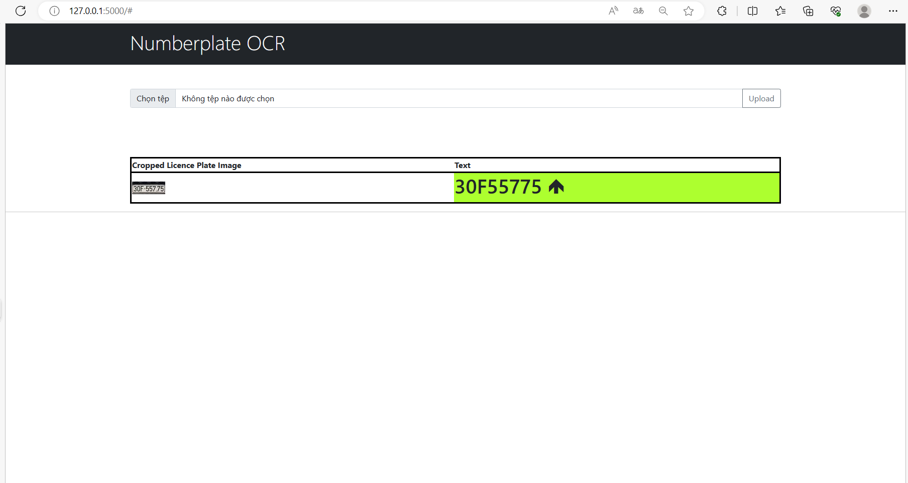

# License_plate_OCR_flask_api
License plate motorbike, car using resnet50 for detection , teseract OCR for recongize character ,....

[data and model at here!](https://drive.google.com/drive/u/3/folders/1NZ-SPZXIqdMoxggYxNzDMtxKxcpWuvyu)

# README

This is a Flask application that allows users to upload an image file and perform optical character recognition (OCR) on it. The OCR process extracts text from the uploaded image and displays it on a web page.

## Requirements

Make sure you have the following requirements installed:

- Python 3.x
- Flask
- Tesseract OCR
- Other dependencies mentioned in `requirements.txt`

## Installation

1. Clone or download the repository to your local machine.
2. Navigate to the project directory.
3. Install the required dependencies using pip.
## Usage
1. Run the Flask application.
   

   

3. Open your web browser and go to 'http://127.0.0.1:5000' to access the application.

4. On the web page, click the "Choose File" button and select an image file for OCR.

5. Click the "Upload" button to perform OCR on the selected image.

6. The extracted text from the image will be displayed on the web page.

## Project Structure

- `app.py`: The main Python file containing the Flask application.
- `detect_and_ocr.py`: A module that performs OCR on the uploaded image.
- `WebApp/`
- `static/`: Static files used by the web application (CSS, images, etc.).
 - `uploadnew/`: Directory to store uploaded image files.
- `templates/`: HTML templates for the web pages.
 - `index.html`: The main HTML template for the application.

## Configuration

You can modify the following variables in `app.py` to customize the application:

- `BASE_PATH`: The base directory of the project.
- `UPLOAD_PATH`: The directory to store uploaded image files.

## License

This project is licensed under the [MIT License](LICENSE).

## Acknowledgments

- The Flask framework: [Flask](https://flask.palletsprojects.com/)
- Tesseract OCR: [Tesseract OCR](https://github.com/tesseract-ocr/tesseract)
